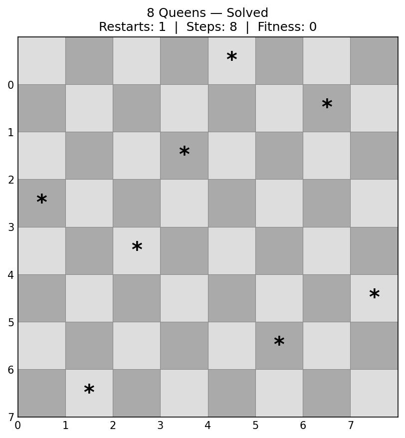
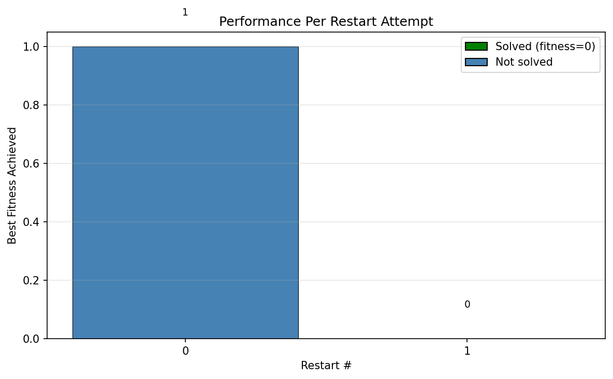

# 8 Queens Hill Climber — Report

## Algorithm Overview

This hill climber uses a **steepest-ascent** strategy with **random restarts** to solve the N-Queens problem.

### Board Representation

The board is represented as a 1D array of length N, where `state[i]` equals the row position of the queen in column `i` (values 0 through N-1). Because each index corresponds to exactly one column, it is structurally impossible to place two queens in the same column. This eliminates an entire class of conflicts before the algorithm even begins.

### Fitness Function

The fitness function counts the number of **pairs of queens** that attack each other. For every pair `(i, j)` where `i < j`, the function checks:

- **Row conflict**: `state[i] == state[j]` — both queens are in the same row.
- **Diagonal conflict**: `|state[i] - state[j]| == |i - j|` — the row distance equals the column distance, meaning they share a diagonal.

A fitness of **0** means no queens attack each other (the board is solved). Lower fitness is better.

### Neighbor Generation

At each step, the algorithm generates all possible neighbors by taking the current board and, for each column, trying every other row in that column. For an 8×8 board this produces **8 × 7 = 56 neighbors** per step. Every neighbor is evaluated, and the one with the lowest fitness is selected (steepest ascent). If multiple neighbors tie for the best fitness, one is chosen at random.

### Termination and Restarts

The climb continues until either:
1. **Fitness = 0** — a valid solution is found and returned immediately.
2. **No neighbor improves fitness** — the algorithm is stuck at a local minimum or plateau.

When stuck, the algorithm immediately discards the current state and generates a new random board (a "restart"). This repeats up to a configurable `max_restarts` limit (default 100). If no solution is found after all restarts, the best state seen across all attempts is returned.

---

## Performance Results

The algorithm was benchmarked across board sizes from N=4 to N=20, running **30 trials per size** with a cap of 200 restarts per trial.

| Board Size (N) | Success Rate | Avg Time (s) | Avg Steps | Avg Restarts |
|:-:|:-:|:-:|:-:|:-:|
| 4 | 100.0% | 0.0001 | 3.9 | 1.0 |
| 6 | 100.0% | 0.0023 | 30.8 | 8.5 |
| 8 | 100.0% | 0.0062 | 27.2 | 5.7 |
| 10 | 100.0% | 0.0393 | 76.1 | 14.3 |
| 12 | 100.0% | 0.1047 | 176.4 | 29.4 |
| 16 | 100.0% | 0.6387 | 239.5 | 30.7 |
| 20 | 93.3% | 3.3933 | 452.0 | 47.1 |

### Success Rate

The algorithm achieves **100% success** for all board sizes up to N=16 within 200 restarts. At N=20, the success rate drops to **93.3%**, meaning roughly 2 out of 30 runs failed to find a solution within the restart budget. This is expected behavior: as the board grows, local minima become harder to escape and more restarts are needed.

### Runtime Performance

Runtime grows approximately **super-linearly** with board size. This is driven by two factors:
1. **Neighbor evaluation cost**: each step evaluates N × (N - 1) neighbors, and each fitness computation is O(N²). This makes each step roughly O(N⁴).
2. **More restarts needed**: larger boards have deeper and more numerous local minima, requiring more attempts before a global solution is found.

For the target 8-Queens problem, the algorithm consistently solves the board in **under 10 milliseconds**.

### Visualizations

The program produces three output figures:

- **Solution Board** — an 8×8 grid showing the final queen placements.
- **Convergence Plot** — fitness over cumulative steps, with vertical red lines marking restart boundaries.
- **Restart Performance** — a bar chart showing the best fitness achieved per restart attempt, with the successful restart highlighted in green.

